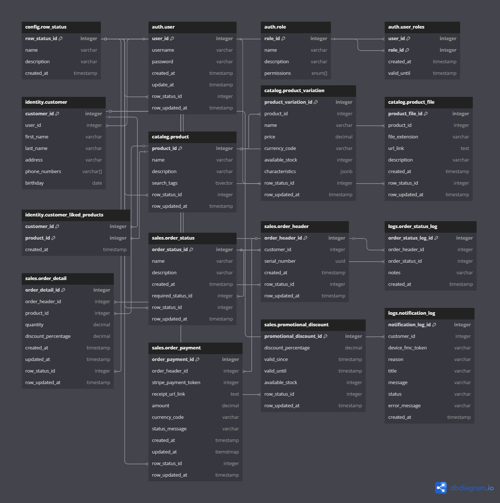

# Database Module Exercises

This repository contains the challenges for the Database module, designed to test and enhance your understanding of SQL queries and transactions.

## Structure

1. **Pagila:** In this exercise you will be provided with a database configured for movie rental information. Your task is to solve each of the queries provided.

2. **Banking:** In this exercise you're provided with the tables account and transaction to simulate a function for handling transactions.

## Getting Started

This folder contains a docker compose file that will start up the database for Pagila and also will create a separate schema for the banking exercise.

### Prerequisites:

- Install Docker Desktop
- Have your PostgreSQL client of your preference

### Steps:

1. Run `docker-compose up` inside of this folder to mount the container and the data for your database.

2. If everything goes well you can open the client of your preference using the following credentials:

```
POSTGRES_PASSWORD: pass_nerdery
POSTGRES_USER: postgres
POSTGRES_DB: nerdery_db
```

### Alternative Setup

In case you have problems installing Docker, you can easily install the PostgreSQL server and client of your preference and create a database on it.

Then you can execute the SQL files in the same order that exists in the `init.db` folder:

```
01-pagila-schema.sql
02-pagila-data.sql
03-transactions.sql
```

# DESCRIPTION FOR ERD MODEL SOLUTION

The ERD model solution create for the challenge can be found [here](https://dbdiagram.io/d/ERD-CHALLENGE-DATABASE-68129ef01ca52373f50ab300).
It contains all of the ERD model information neccesary to replicate and export it to PostgreSQL.

Here's the image that describes the model:


Here's also the code that describes the model:

```
// SOLUTION FOR ERD IN MODULE 4 NERDERY PROGRAM NODE JS - BY ERICK HUALLA

Table config.row_status {
  row_status_id integer [primary key]
  name varchar
  description varchar
  created_at timestamp
}

Table auth.user {
  user_id integer [primary key]
  username varchar
  password varchar
  created_at timestamp
  update_at timestamp
  row_status_id integer
  row_updated_at timestamp
}

Table auth.role {
  role_id integer [primary key]
  name varchar
  description varchar
  permissions enum[]
}

Table auth.user_roles {
  user_id integer [primary key]
  role_id integer [primary key]
  created_at timestamp
  valid_until timestamp
}

Table identity.customer {
  customer_id integer [primary key]
  user_id integer
  first_name varchar
  last_name varchar
  address varchar
  phone_numbers varchar[]
  birthday date
}

Table catalog.product {
  product_id integer [primary key]
  name varchar
  description varchar
  search_tags tsvector
  row_status_id integer
  row_updated_at timestamp
}

Table catalog.product_variation {
  product_variation_id integer [primary key]
  product_id integer
  name varchar
  price decimal
  currency_code varchar
  available_stock integer
  characteristics jsonb
  row_status_id integer
  row_updated_at timestamp
}

Table catalog.product_file {
  product_file_id integer [primary key]
  product_id integer
  file_extension varchar
  url_link text
  description varchar
  created_at timestamp
  row_status_id integer
  row_updated_at timestamp
}

Table identity.customer_liked_products {
  customer_id integer [primary key]
  product_id integer [primary key]
  created_at timestamp
}

Table sales.order_status {
  order_status_id integer [primary key]
  name varchar
  description varchar
  created_at timestamp
  required_status_id integer
  row_status_id integer
  row_updated_at timestamp
}

Table sales.order_header {
  order_header_id integer [primary key]
  customer_id integer
  serial_number uuid
  created_at timestamp
  row_status_id integer
  row_updated_at timestamp
}

Table logs.order_status_log {
  order_status_log_id integer [primary key]
  order_header_id integer
  order_status_id integer
  notes varchar
  created_at timestamp
}

Table sales.order_detail {
  order_detail_id integer [primary key]
  order_header_id integer
  product_id integer
  quantity decimal
  discount_percentage decimal
  created_at timestamp
  updated_at timestamp
  row_status_id integer
  row_updated_at timestamp
}

Table sales.order_payment {
  order_payment_id integer [primary key]
  order_header_id integer
  stripe_payment_token integer
  receipt_url_link text
  amount decimal
  currency_code varchar
  status_message varchar
  created_at timestamp
  updated_at tiemstmap
  row_status_id integer
  row_updated_at timestamp
}

Table sales.promotional_discount {
  promotional_discount_id integer [primary key]
  discount_percentage decimal
  valid_since timestamp
  valid_until timestamp
  available_stock integer
  row_status_id integer
  row_updated_at timestamp
}

Table logs.notification_log {
  notification_log_id integer [primary key]
  customer_id integer
  device_fmc_token varchar
  reason varchar
  title varchar
  message varchar
  status varchar
  error_message varchar
  created_at timestamp
}

Ref: auth.user.row_status_id > config.row_status.row_status_id

Ref: auth.user_roles.role_id > auth.role.role_id
Ref: auth.user_roles.user_id > auth.user.user_id

Ref: identity.customer.user_id > auth.user.user_id

Ref: catalog.product.row_status_id > config.row_status.row_status_id

Ref: catalog.product_variation.product_id > catalog.product.product_id
Ref: catalog.product_variation.row_status_id > config.row_status.row_status_id

Ref: catalog.product_file.product_id > catalog.product.product_id
Ref: catalog.product_file.row_status_id > config.row_status.row_status_id

Ref: identity.customer_liked_products.customer_id > identity.customer.customer_id
Ref: identity.customer_liked_products.product_id > catalog.product.product_id

Ref: sales.order_status.required_status_id > sales.order_status.order_status_id
Ref: sales.order_status.row_status_id > config.row_status.row_status_id

Ref: sales.order_header.customer_id > identity.customer.customer_id
Ref: sales.order_header.row_status_id > config.row_status.row_status_id

Ref: logs.order_status_log.order_header_id > sales.order_header.order_header_id
Ref: logs.order_status_log.order_status_id > sales.order_status.order_status_id

Ref: sales.order_detail.order_header_id > sales.order_header.order_header_id
Ref: sales.order_detail.product_id > catalog.product.product_id
Ref: sales.order_detail.row_status_id > config.row_status.row_status_id

Ref: sales.order_payment.order_header_id > sales.order_header.order_header_id
Ref: sales.order_payment.row_status_id > config.row_status.row_status_id

Ref: sales.promotional_discount.row_status_id > config.row_status.row_status_id

Ref: logs.notification_log.customer_id > identity.customer.customer_id
```

## Notes

It is important to say that we use a single table to store the shopping cart and order information since they share almost all of the columns. The state to differenciate between an order and shopping cart is in the sales.order_status table.
