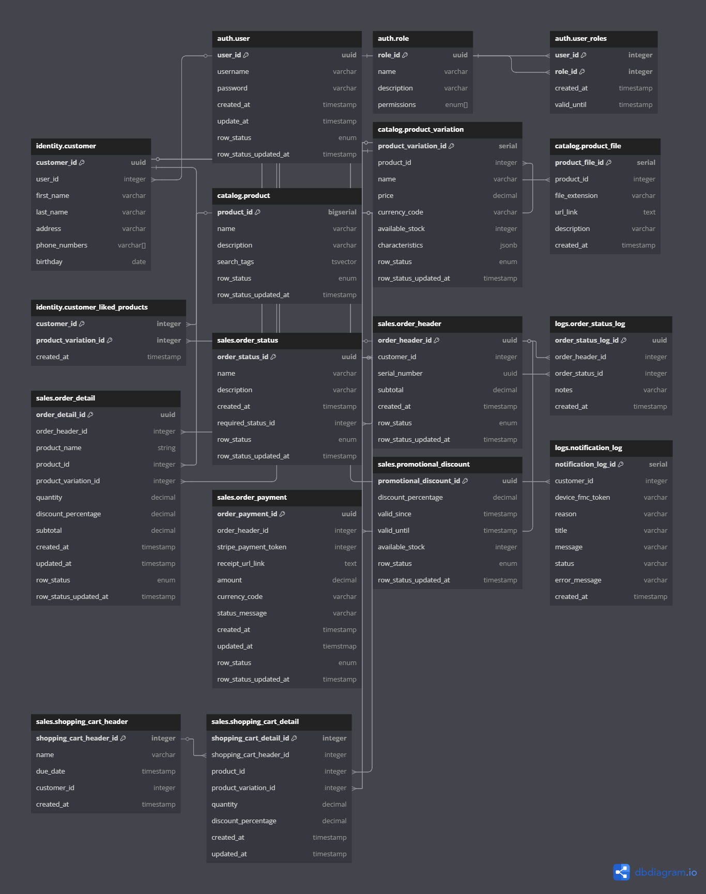

# Database Module Exercises

This repository contains the challenges for the Database module, designed to test and enhance your understanding of SQL queries and transactions.

## Structure

1. **Pagila:** In this exercise you will be provided with a database configured for movie rental information. Your task is to solve each of the queries provided.

2. **Banking:** In this exercise you're provided with the tables account and transaction to simulate a function for handling transactions.

## Getting Started

This folder contains a docker compose file that will start up the database for Pagila and also will create a separate schema for the banking exercise.

### Prerequisites:

- Install Docker Desktop
- Have your PostgreSQL client of your preference

### Steps:

1. Run `docker-compose up` inside of this folder to mount the container and the data for your database.

2. If everything goes well you can open the client of your preference using the following credentials:

```
POSTGRES_PASSWORD: pass_nerdery
POSTGRES_USER: postgres
POSTGRES_DB: nerdery_db
```

### Alternative Setup

In case you have problems installing Docker, you can easily install the PostgreSQL server and client of your preference and create a database on it.

Then you can execute the SQL files in the same order that exists in the `init.db` folder:

```
01-pagila-schema.sql
02-pagila-data.sql
03-transactions.sql
```

# DESCRIPTION FOR ERD MODEL SOLUTION

The ERD model solution create for the challenge can be found [here](https://dbdiagram.io/d/ERD-CHALLENGE-DATABASE-68129ef01ca52373f50ab300).
It contains all of the ERD model information neccesary to replicate and export it to PostgreSQL.

Here are some points to take in count:

- Any row can only has one state at a time, this means that the rows cannot be `delete` and `inactive` at the same time due to it's not needed (by requirements) to store more than on state per row. The column that stores the row status is `row_status` and its of type `ENUM` to allow status flexibility for each table.

- The primary key type for most tables is `UUID`. This is because the database must not have predictable values for possible vulnerable rows. However, the exception for that rule are those tables that doesn't contain or are related to sensible information, this applies for the following tables: `catalog.product`, `catalog.product_file`, `logs.notification_log`.

- Each item in `sales.order_detail` can only has one discount promotion applied. It's delimited in that way to not overcomplicate the solution since it's not included into the requirements.

- There is no relation from `sales.order_detail` to `sales.promotional_discount` because the promotion config can change over time so it's preferable to store the discount percentage instead of the relation (and that helps to the total calculation too).

- There are aditional fields to store the literal product name and subtotal in `sales.order_detail` because these fields can change over time and we need to still keep the relation with the product.

Here's the image that describes the model:


Here's also the code that describes the model:

```
// SOLUTION FOR ERD IN MODULE 4 NERDERY PROGRAM NODE JS - BY ERICK HUALLA

Table auth.user {
  user_id uuid [primary key]
  username varchar
  password varchar
  created_at timestamp
  update_at timestamp
  row_status enum
  row_status_updated_at timestamp
}

Table auth.role {
  role_id uuid [primary key]
  name varchar
  description varchar
  permissions enum[]
}

Table auth.user_roles {
  user_id integer [primary key]
  role_id integer [primary key]
  created_at timestamp
  valid_until timestamp
}

Table identity.customer {
  customer_id uuid [primary key]
  user_id integer
  first_name varchar
  last_name varchar
  address varchar
  phone_numbers varchar[]
  birthday date
}

Table catalog.product {
  product_id bigserial [primary key]
  name varchar
  description varchar
  search_tags tsvector
  row_status enum
  row_status_updated_at timestamp
}

Table catalog.product_variation {
  product_variation_id serial [primary key]
  product_id integer
  name varchar
  price decimal
  currency_code varchar
  available_stock integer
  characteristics jsonb
  row_status enum
  row_status_updated_at timestamp
}

Table catalog.product_file {
  product_file_id serial [primary key]
  product_id integer
  file_extension varchar
  url_link text
  description varchar
  created_at timestamp
}

Table identity.customer_liked_products {
  customer_id integer [primary key]
  product_variation_id integer [primary key]
  created_at timestamp
}

Table sales.order_status {
  order_status_id uuid [primary key]
  name varchar
  description varchar
  created_at timestamp
  required_status_id integer
  row_status enum
  row_status_updated_at timestamp
}

Table sales.shopping_cart_header {
  shopping_cart_header_id integer [primary key]
  name varchar
  due_date timestamp
  customer_id integer
  created_at timestamp
}

Table sales.shopping_cart_detail {
  shopping_cart_detail_id integer [primary key]
  shopping_cart_header_id integer
  product_id integer
  product_variation_id integer
  quantity decimal
  discount_percentage decimal
  created_at timestamp
  updated_at timestamp
}

Table sales.order_header {
  order_header_id uuid [primary key]
  customer_id integer
  serial_number uuid
  subtotal decimal
  created_at timestamp
  row_status enum
  row_status_updated_at timestamp
}

Table logs.order_status_log {
  order_status_log_id uuid [primary key]
  order_header_id integer
  order_status_id integer
  notes varchar
  created_at timestamp
}

Table sales.order_detail {
  order_detail_id uuid [primary key]
  order_header_id integer
  product_name string
  product_id integer
  product_variation_id integer
  quantity decimal
  discount_percentage decimal
  subtotal decimal
  created_at timestamp
  updated_at timestamp
  row_status enum
  row_status_updated_at timestamp
}

Table sales.order_payment {
  order_payment_id uuid [primary key]
  order_header_id integer
  stripe_payment_token integer
  receipt_url_link text
  amount decimal
  currency_code varchar
  status_message varchar
  created_at timestamp
  updated_at tiemstmap
  row_status enum
  row_status_updated_at timestamp
}

Table sales.promotional_discount {
  promotional_discount_id uuid [primary key]
  discount_percentage decimal
  valid_since timestamp
  valid_until timestamp
  available_stock integer
  row_status enum
  row_status_updated_at timestamp
}

Table logs.notification_log {
  notification_log_id serial [primary key]
  customer_id integer
  device_fmc_token varchar
  reason varchar
  title varchar
  message varchar
  status varchar
  error_message varchar
  created_at timestamp
}

Ref: auth.user_roles.role_id > auth.role.role_id
Ref: auth.user_roles.user_id > auth.user.user_id

Ref: identity.customer.user_id > auth.user.user_id

Ref: catalog.product_variation.product_id > catalog.product.product_id

Ref: catalog.product_file.product_id > catalog.product.product_id

Ref: identity.customer_liked_products.customer_id > identity.customer.customer_id
Ref: identity.customer_liked_products.product_variation_id > catalog.product_variation.product_variation_id

Ref: sales.order_status.required_status_id > sales.order_status.order_status_id

Ref: sales.order_header.customer_id > identity.customer.customer_id

Ref: logs.order_status_log.order_header_id > sales.order_header.order_header_id
Ref: logs.order_status_log.order_status_id > sales.order_status.order_status_id

Ref: sales.order_detail.order_header_id > sales.order_header.order_header_id
Ref: sales.order_detail.product_id > catalog.product.product_id
Ref: sales.order_detail.product_variation_id > catalog.product_variation.product_variation_id

Ref: sales.shopping_cart_detail.shopping_cart_header_id > sales.shopping_cart_header.shopping_cart_header_id
Ref: sales.shopping_cart_detail.product_id > catalog.product.product_id
Ref: sales.shopping_cart_detail.product_variation_id > catalog.product_variation.product_variation_id

Ref: sales.order_payment.order_header_id > sales.order_header.order_header_id

Ref: logs.notification_log.customer_id > identity.customer.customer_id
```
